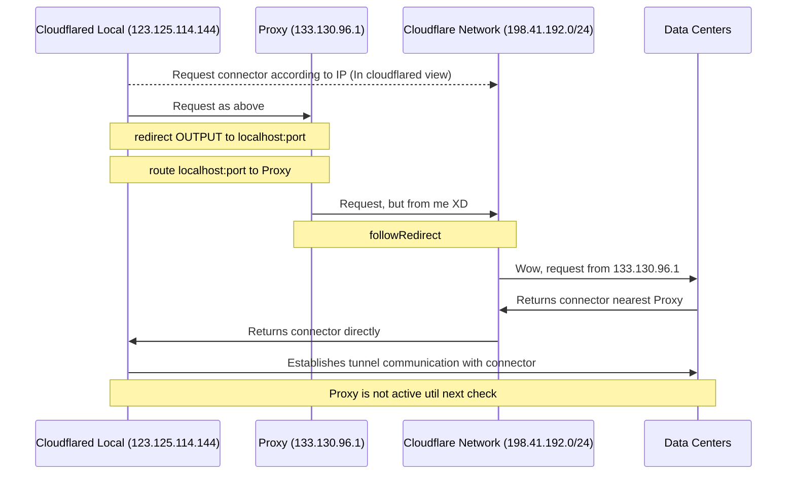

# CF-Tunnel-Transparent-Proxy



Este proyecto es un ejemplo sencillo que muestra cómo utilizar un proxy transparente cuando `cloudflared` selecciona el endpoint en un centro de datos para establecer la conexión del túnel.
Asumo que ya sabes qué es [Cloudflare Zero Trust](https://developers.cloudflare.com/cloudflare-one/) y cómo utilizarlo.
¿Por qué y cuándo usar un proxy transparente? Diferentes personas tienen diferentes motivos.
Por supuesto, necesitarás otra máquina adecuada para que funcione como servidor proxy.

Entorno de prueba: 

- Ubuntu 22.04.4 LTS
- Docker versión 26.1.4, build 5650f9
- Docker Compose versión v2.27.1

Se utiliza Docker como entorno de ejecución para facilitar su funcionamiento en diferentes plataformas.

Para quienes no puedan acceder a Docker Hub, estos documentos oficiales pueden ser útiles:

- [Configure the Docker daemon to use a proxy server](https://docs.docker.com/config/daemon/systemd/#httphttps-proxy)
- [Configure Docker to use a proxy server](https://docs.docker.com/network/proxy/)
- [为群晖 Container Manager 配置代理](https://blog.chai.ac.cn/posts/docker-proxy)


## Cómo utilizarlo

### Ejecutar Localmente sin Proxy Primero

1. Instala [Docker](https://docs.docker.com/engine/install/) y configúralo.
2. Clona este repositorio y entra en el directorio `local`.
3. Modifica `TUNNEL_TOKEN` en el archivo [.env](./local/.env).
4. Ejecuta `docker compose up` y revisa el log.

Actualmente, el estado de tu túnel debería ser `Healthy` si la conexión es exitosa.
Aún no lo hemos pasado por el proxy.

`cloudflared` se conecta a la red global de Cloudflare en las direcciones `198.41.192.0/24`, `198.41.200.0/24` (ver [Tunnel with firewall](https://developers.cloudflare.com/cloudflare-one/connections/connect-networks/deploy-tunnels/tunnel-with-firewall/)) puerto `7844`. Luego selecciona un centro de datos para establecer la conexión del túnel y proporciona la información de `location`.
A veces, la conexión entre tu máquina y el centro de datos seleccionado no es estable.
Sin embargo, la ubicación podría cambiar tras utilizar un servidor proxy (esa es una de las razones).
Idealmente, los proxies `http` y `socks` deberían ser compatibles directamente con Cloudflare Tunnel.
Lamentablemente, no es compatible en este momento.

### Redirigir Tráfico de Cloudflare (ej. Netfilter)

Una solución alternativa para sistemas Linux es:

- Añadir reglas de `iptables` para redirigir el tráfico de SALIDA (OUTPUT) de Cloudflare a un puerto local como el `12306`.
- Utilizar herramientas como `Xray-Core` para escuchar en el puerto `12306` y enrutar el tráfico hacia un servidor proxy.

Se proporciona un script de shell [iptable.sh](./local/iptable.sh) para añadir y eliminar las reglas.

- Ejecuta `./iptable.sh add` para aplicar, añadir y persistir las reglas de Cloudflare.
- Ejecuta `./iptable.sh remove` para eliminar las reglas de Cloudflare.
- Ejecuta `./iptable.sh list` para mostrar todas las reglas de salida.

Siéntete libre de cambiar el número de puerto por cualquier otro válido.
Luego lo reconfiguraremos en Xray.

Una vez que añadas las reglas de Cloudflare, puede que notes que tu máquina no puede conectar con la red de Cloudflare.
Este es el efecto de la redirección. El destino se establece en 127.0.0.1 por defecto.
Cambiaremos el destino al servidor proxy más adelante. Por ahora, solo añade las reglas.
Configuremos el servidor proxy para que trabaje en conjunto con la redirección.

### Configurar el Servidor Proxy

Inicia sesión en tu servidor proxy y sigue estos pasos:

1. Instala [Docker](https://docs.docker.com/engine/install/) y configúralo.
2. Clona este repositorio y entra en el directorio `proxy`.
3. Edita la configuración en [config.json](./proxy/config.json).
   - Cambia el número de puerto `inbound` (10086 por defecto) por uno válido.
   - Cambia el `id` por un nuevo UUID (ejecuta `uuidgen` para obtener uno).
4. Ejecuta `docker compose up -d` para ejecutarlo en segundo plano.
5. Ejecuta `docker logs -f cf-tunnel-xray` para observar el log de Xray.

```shell
Xray 1.8.13 (Xray, Penetrates Everything.) Custom (go1.22.3 linux/amd64)
A unified platform for anti-censorship.
2024/06/16 14:06:32 [Info] infra/conf/serial: Reading config: /etc/xray/config.json
2024/06/16 14:06:32 [Debug] app/log: Logger started
2024/06/16 14:06:32 [Debug] app/proxyman/inbound: creating stream worker on 0.0.0.0:10086
2024/06/16 14:06:32 [Info] transport/internet/tcp: listening TCP on 0.0.0.0:10086
2024/06/16 14:06:32 [Warning] core: Xray 1.8.13 started
```

Ahora el servidor proxy está listo. Toma nota de su IP (¡no la 0.0.0.0 de arriba!), el número de puerto y el UUID.

### Iniciar Túnel Local con Proxy

1. Vuelve a la máquina local y entra en el directorio `local`.
2. Edita la configuración de salida (outbound) en [config.json](./local/config.json).
   - Cambia el puerto de escucha (12306 por defecto) al puerto que configuraste en iptables.
   - Cambia la IP (127.0.0.1 por defecto) por la IP accesible de tu servidor proxy.
   - Cambia el puerto (10086 por defecto) al puerto de entrada (inbound) de tu servidor proxy.
   - Cambia el `id` al UUID aceptado en la entrada de tu servidor proxy.
3. Ejecuta `docker compose down` para detener el túnel y xray actuales.
4. Ejecuta `docker compose up` para revisar el log y verificar temporalmente.

```shell
cf-tunnel-xray         | 2024/06/16 14:16:19 [Debug] 
transport/internet: dialing to tcp:123.123.123.123:10086
```

Aquí `123.123.123.123` debe ser la IP de tu servidor proxy.

Y podrías notar que la ubicación (`location`) del endpoint ha cambiado según el servidor proxy.
El log mostrará con qué endpoint se ha establecido la conexión.

Ya está todo hecho.
Ejecuta `docker compose up -d` para ejecutarlo en segundo plano.

Si deseas revisar los archivos de log mientras se ejecuta:

- Ejecuta `docker logs -f cf-tunnel-cloudflared` para ver el log de cloudflared.
- Ejecuta `docker logs -f cf-tunnel-xray` para ver el log de xray.

Leer los logs de nivel `debug` puede ayudarte a entender los detalles.

## Añadir Hosts a la Máquina Local (Opcional)

`cloudflared` se conecta a ciertas direcciones IP en el puerto 443 para habilitar algunas [funciones opcionales](https://developers.cloudflare.com/cloudflare-one/connections/connect-networks/deploy-tunnels/tunnel-with-firewall/#optional). 

Estas direcciones IP están en el rango `104.X.X.X` y pueden añadirse a tu archivo `/etc/hosts` para acelerar potencialmente la conexión:

```shell
104.16.105.127    api.cloudflare.com
104.16.105.127    update.argotunnel.com
104.16.105.127    pqtunnels.cloudflareresearch.com
104.16.105.127    pqtunnels.cloudflareresearch.com
```

La dirección `104.16.105.127` fue elegida basándose en los resultados de [CloudflareSpeedTest](https://github.com/XIU2/CloudflareSpeedTest).

## ¿Qué sigue?

Este proyecto utiliza `vmess` como protocolo para comunicarse con el servidor proxy.
Puedes certificar el servidor proxy y usar `tls` para asegurar la conexión.
Sin embargo, esto puede ser un poco complejo para principiantes, sugerido solo para quienes ya sepan cómo hacerlo.

## FAQ

Se añadirán si surgen dudas.

## Agradecimientos

- [badafans/better-cloudflare-ip](https://github.com/badafans/better-cloudflare-ip/)
- [cloudflare/cloudflared#1025](https://github.com/cloudflare/cloudflared/issues/1025)
- [Cloudflare Docs: Tunnel with firewall](https://developers.cloudflare.com/cloudflare-one/connections/connect-networks/deploy-tunnels/tunnel-with-firewall/)
- [CloudflareSpeedTest](https://github.com/XIU2/CloudflareSpeedTest)
