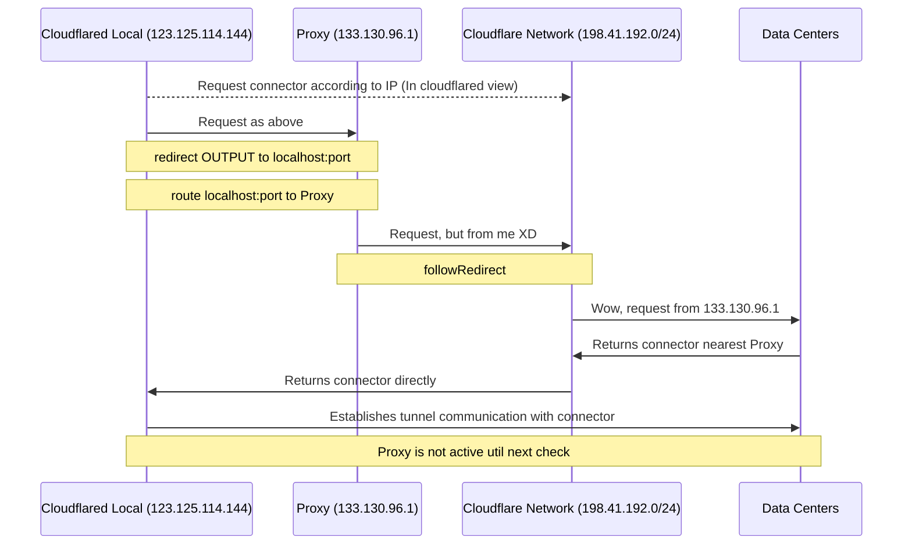

# CF-Tunnel-Transparent-Proxy



This project is a simplest example showing how to use a transparent proxy 
when `cloudflared` select endpoint in a data center to establish the tunnel connection.
I assume you have already known what is 
[Cloudflare Zero Trust](https://developers.cloudflare.com/cloudflare-one/) and how to use it.
Why and when use a transparent proxy? Different people have different reasons.
Of cousre, you need have another satisfied machine as the proxy server.

Test environment: 

- Ubuntu 22.04.4 LTS
- Docker version 26.1.4, build 5650f9
- Docker Compose version v2.27.1

Use Docker as the runtime environment to make it easier to run on different platforms.

For someone who can not access the docker hub, these offical documents may be helpful:

- [Configure the Docker daemon to use a proxy server](https://docs.docker.com/config/daemon/systemd/#httphttps-proxy)
- [Configure Docker to use a proxy server](https://docs.docker.com/network/proxy/)
- [为群晖 Container Manager 配置代理](https://blog.chai.ac.cn/posts/docker-proxy)


## How to use

### Run Locally without Proxy First

1. Install [Docker](https://docs.docker.com/engine/install/) and configure it.
2. Clone this repository and change to `local` directory.
3. Modify `TUNNEL_TOKEN` in [.env](./local/.env) file.
4. Run `docker compose up` and check the log.

Currently, the status of your tunnel should be `Healthy` if connection is successful.
We have not proxy it yet. 

`cloudflared` connects to cloudflare’s global network on addresses `198.41.192.0/24`, `198.41.200.0/24` 
(see [Tunnel with firewall](https://developers.cloudflare.com/cloudflare-one/connections/connect-networks/deploy-tunnels/tunnel-with-firewall/)) port `7844`. 
Then it selects a data center to establish tunnel connection and give the `location` information.
Sometimes the connection between your machine and selected data center is not stable.
But the location could change after using a proxy server (that's a reason).
Ideally `http` and `socks` proxy should be supported by cloudflare Tunnel directly.
Unfortunately, it's not supported at the moment.

### Redirect Cloudflare Traffic (eg. Netfilter)

A workround for Linux system is: 

- Add `iptables` rules to redirect cloudlfare OUTPUT traffic to a local port like `12306`.
- Use tools like `Xray-Core` to listen on `12306` and routes the traffic to a proxy server.

A shell script [iptable.sh](./local/iptable.sh) is provided to add and delete the rules.

- Run `./iptable.sh add` to aplly add and persist cloudfalre rules.
- Run `./iptable.sh remove` to remove cloudfalre rules.
- Run `./iptable.sh list` to show all output rules.

Feel free to change the port number to any valid one.
And we will re-configure it in xray later.

Once you add Cloudflare rules, 
you may notice that your machine cannot connect to the Cloudflare network.
This is the effect of redirection. The target is set as 127.0.0.1 as default.
We will change target to the proxy server later. So just add the rules right now.
Let's configure the proxy server to work in conjunction with redirection.

### Configure the Proxy Server

Login to your proxy server and follow the steps below:

1. Install [Docker](https://docs.docker.com/engine/install/) and configure it.
2. Clone this repository and change to `proxy` directory.
3. Edit the configuration in [config.json](./proxy/config.json).
   - Change `inbound` port number (10086 as default) to any valid one.
   - Change `id` to a new UUID (run `uuidgen` to get one).
4. Run `docker compose up -d` to run it detached.
5. Run `docker logs -f cf-tunnel-xray` to watch the xray log.

```shell
Xray 1.8.13 (Xray, Penetrates Everything.) Custom (go1.22.3 linux/amd64)
A unified platform for anti-censorship.
2024/06/16 14:06:32 [Info] infra/conf/serial: Reading config: /etc/xray/config.json
2024/06/16 14:06:32 [Debug] app/log: Logger started
2024/06/16 14:06:32 [Debug] app/proxyman/inbound: creating stream worker on 0.0.0.0:10086
2024/06/16 14:06:32 [Info] transport/internet/tcp: listening TCP on 0.0.0.0:10086
2024/06/16 14:06:32 [Warning] core: Xray 1.8.13 started
```

Now proxy server is ready. Take note of its IP (not 0.0.0.0 above!), port number and UUID.

### Start Local Tunnel with Proxy

1. Switch to local machine and change to `local` directory.
2. Edit the outbound configuration in [config.json](./local/config.json).
   - Change listen port (12306 as default) to the port you set in iptable.
   - Change IP (127.0.0.1 as default) to accessible IP of your proxy server.
   - Change port (10086 as default) to inbound of your proxy server.
   - Change `id` to inbound acceptable UUID of your proxy server.
3. Run `docker compose down` to stop the current tunnel and xray.
4. Run `docker compose up` to check the log to verify temporary.

```shell
cf-tunnel-xray         | 2024/06/16 14:16:19 [Debug] 
transport/internet: dialing to tcp:123.123.123.123:10086
```

Here `123.123.123.123` should be your proxy server IP.

And you might find the endpoint `location` changed according to the proxy server.
The log will show the connection with which endpoint is established.

Now all things are done. 
Run `docker compose up -d` to run it detached.

If you want to check log file when running:

- Run `docker logs -f cf-tunnel-cloudflared` to watch cloudflared log.
- Run `docker logs -f cf-tunnel-xray` to watch xray log.

Read debug level logs could help your understand the details.

## Add Hosts to Local Machine (Optional)

`cloudflared` connects to certain IP addresses on port 443 to enable some 
[optional features](https://developers.cloudflare.com/cloudflare-one/connections/connect-networks/deploy-tunnels/tunnel-with-firewall/#optional). 

These IP addresses are in the `104.X.X.X` range and 
can be added to your `/etc/hosts` file to potentially speed up the connection:

```shell
104.16.105.127    api.cloudflare.com
104.16.105.127    update.argotunnel.com
104.16.105.127    pqtunnels.cloudflareresearch.com
104.16.105.127    pqtunnels.cloudflareresearch.com
```

The address `104.16.105.127` was chosen based on the results 
from [CloudflareSpeedTest](https://github.com/XIU2/CloudflareSpeedTest) result.

## What Next?

This project use `vmess` as the protocol to communicate with the proxy server.
You can cerfiticate the proxy server and use `tls` to secure the connection.
But it may be a little complex for beginners, just for who has already known how to do it.

## FAQ

Will be added if any.

## Acknowledgement

- [badafans/better-cloudflare-ip](https://github.com/badafans/better-cloudflare-ip/)
- [cloudflare/cloudflared#1025](https://github.com/cloudflare/cloudflared/issues/1025)
- [Cloudflare Docs: Tunnel with firewall](https://developers.cloudflare.com/cloudflare-one/connections/connect-networks/deploy-tunnels/tunnel-with-firewall/)
- [CloudflareSpeedTest](https://github.com/XIU2/CloudflareSpeedTest)
